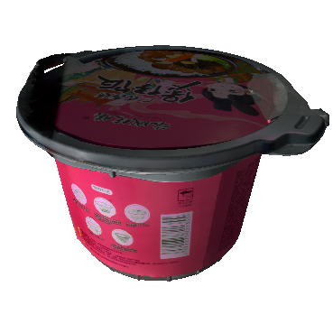
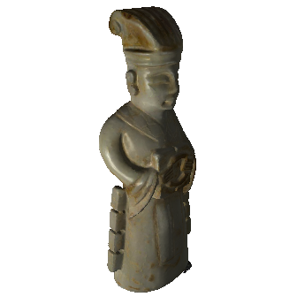
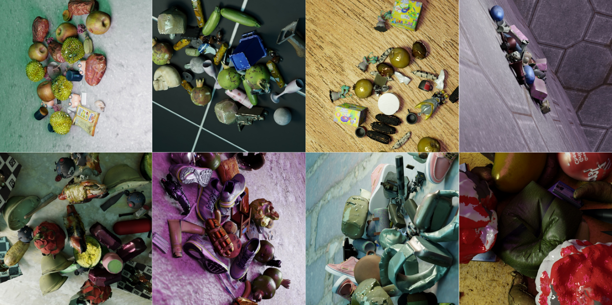
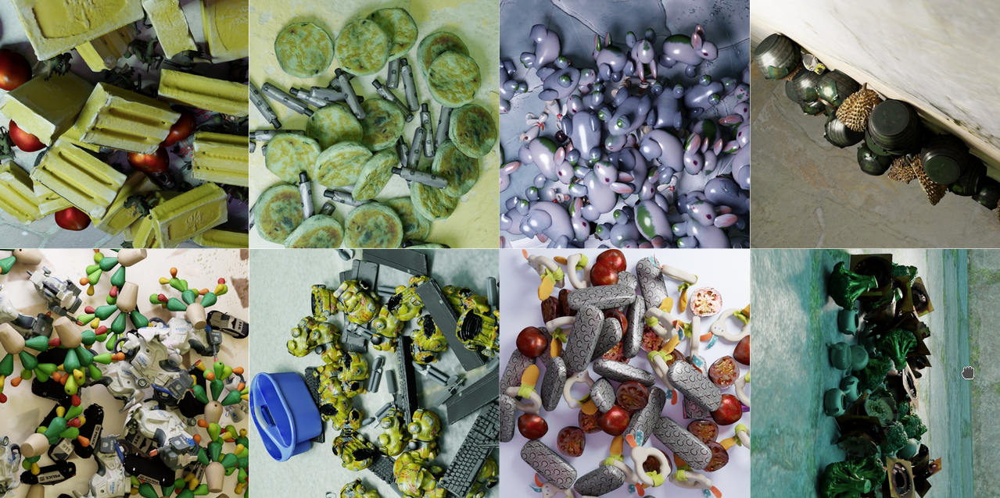

# Clutter6D: Synthetic 6D Object Pose Estimation Dataset Generator

A comprehensive pipeline for generating synthetic datasets for 6D object pose estimation, segmentation and detection using BlenderProc and PyTorch3D.

## Overview

This project consists of two main components:
1. **Query Generation**: Creates synthetic cluttered scenes with multiple objects using BlenderProc
2. **Template Generation**: Renders object templates from multiple viewpoints using PyTorch3D

## Dataset Background

Existing datasets fall short for large-scale 6D pose estimation: real datasets lack model diversity (<100 objects) and are costly to create, while synthetic datasets like MegaPose (21k objects) and Omni6D-XL (15k objects) don't support multi-instance cluttered scenes.

**Our Solution: Clutter6D Dataset**
- **Models**: 10,481 high-quality CAD models from GSO, OO3D, and Objaverse across 681 categories
- **Rendering**: BlenderProc with PBR rendering, physics simulation for realistic clutter
- **Two variants**: 
  - Household (10-20 object classes, fewer instances)
  - Industrial (2-5 object classes, more instances per class)
- **Scene generation**: Poisson-distributed instance counts, randomized materials/lighting, 25 camera views per scene at 700×700 resolution
- **Templates**: Fast PyTorch3D renderer creates 42 viewpoints per object in HDF5 format with camera matrices and 10k surface points

The dataset provides significantly denser, more cluttered scenes than existing benchmarks while maintaining photorealistic quality through high-quality 3D scans.

### Dataset Examples

#### 3D CAD Model Samples
<div align="center">
  
  
  <br>
  <em>10,481 High-quality 3D CAD models from GSO, OO3D, and Objaverse are used for Clutter6D.</em>
</div>

#### Clutter6D Scene Renders
<div align="center">
  
  
  <br>
  <em>Left: Household variant with diverse object classes. Right: Industrial variant with multiple instances per class.</em>
</div>

#### Template Rendering Example
<div align="center">
  
  <br>
  <em>42-viewpoint template grid generated using icosphere sampling for fast template matching.</em>
</div>

## Installation

### Prerequisites
- Anaconda or Miniconda
- CUDA-compatible GPU

### Environment Setup

1. Clone the repository and navigate to the project directory:
```bash
git clone <repository-url>
cd clutter6d
```

2. Create the conda environment:
```bash
conda env create -f environment.yml
conda activate clutter6d
```

3. Install additional dependencies:
```bash
# Install PyTorch3D (for template generation)
pip install pytorch3d

# Install other required packages
pip install h5py pillow
```

## Usage

### 1. Query Image Generation

Generate synthetic cluttered scenes with BOP-format annotations:

```bash
python render_queries.py --config config.yml
```

**Key Features:**
- Randomized object placement using physics simulation
- Poisson distribution for realistic instance counts
- Random materials, lighting, and CC0 texture backgrounds
- BOP-format output with pose annotations and segmentation masks
- Configurable scene complexity and object parameters

**Configuration (`config.yml`):**
- `num_scenes`: Number of scenes to generate
- `min/max_objects_per_scene`: Object class variety per scene
- `min/max_images_per_scene`: Camera viewpoints per scene
- `poisson_lambda/shift`: Controls instance count distribution
- Object size ranges, positioning parameters, etc.

**Output:**
- BOP-format dataset in `data/` directory
- RGB images, depth maps, segmentation masks
- Camera intrinsics and pose annotations
- Object pose ground truth

### 2. Template Generation

Render object templates from multiple viewpoints for template matching:

```bash
python render_templates.py --config template_generation/config.yml --skip_existing
```

**Key Features:**
- Multi-GPU batch processing
- Icosphere-based viewpoint sampling
- HDF5 storage with JPEG compression
- Surface point sampling for each object
- Camera intrinsics and extrinsics storage

**Configuration (`template_generation/config.yml`):**
- `base_models_dir`: Path to 3D model datasets
- `output_root`: Template storage directory
- `image_size`: Render resolution (should match query resolution)
- `subdivisions`: Viewpoint density (0=12 views, 1=42 views, 2=162 views)
- GPU memory management parameters

**Output:**
- HDF5 files per object containing:
  - Multi-view RGB templates (JPEG compressed)
  - Camera intrinsic matrices
  - Camera extrinsic matrices  
  - Surface point samples

### Command Line Options

**Query Generation:**
```bash
python render_queries.py --config config.yml --output_dir /custom/path
```

**Template Rendering:**
```bash
python render_templates.py \
    --config template_generation/config.yml \
    --skip_existing \
    --base_models_dir /path/to/models \
    --output_root /path/to/templates \
    --image_size 700 \
    --subdivisions 1
```
